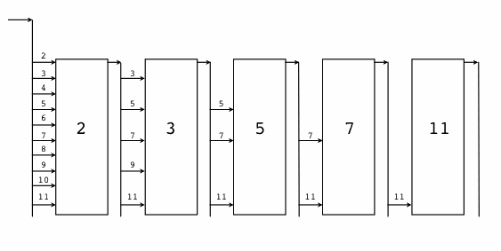
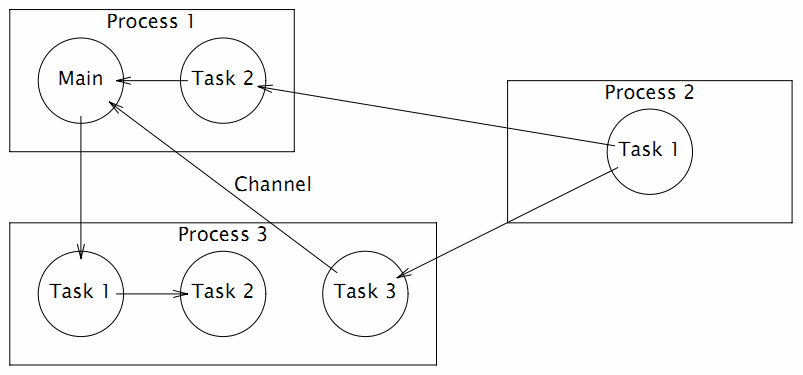

# 1.2. Hello, World 的革命

在创世纪章节中我们简单介绍了Go语言的演化基因族谱，对其中来自贝尔实验室特有并发编程基因做了重点介绍，最后引出了Go语言版的“Hello, World”程序。其实“Hello, World”程序是展示各种语言特性的最好的例子，是通向该语言的一个窗口。这一节我们就沿着各个编程语言演化的时间轴，简单回顾下“Hello, World”程序是如何逐步演化到目前的Go语言形式、最终完成“Hello, World”革命使命的。


## B语言 - Ken Thompson, 1972

首先是B语言，B语言是Go语言之父贝尔实验室的Ken Thompson早年间开发的一种通用的程序设计语言，设计目的是为了用于辅助UNIX系统的开发。但是因为B语言缺乏灵活的类型系统导致使用比较困难。后来，Ken Thompson的同事丹尼斯·利奇以B语言为基础开发出C语言，C语言因为提供了丰富的类型，极大地增加了语言的表达能力。目前C语言依然是世界上最常用的程序语言之一。自从被C语言取代之后，B语言就已经成为了历史只存在于各种文献之中了。

目前，见到的B语言版本的“Hello World”一般认为是来自于Brian W. Kernighan编写的B语言入门教程（Go核心代码库中的第一个提交者名字正是Brian W. Kernighan），程序如下：

```c
main() {
	extrn a, b, c;
	putchar(a); putchar(b); putchar(c);
	putchar('!*n');
}
a 'hell';
b 'o, w';
c 'orld';
```

由于B语言缺乏灵活的数据类型，只能分别以`a/b/c`全局变量来定义要输出的内容，并且每个变量的长度必须对齐到了4个字节（有一种写汇编语言的感觉）。然后通过多次调用`putchar`函数输出字符，最后一个`'!*n'`表示输出一个换行的意思。

总体来说，B语言虽然简单，但是程序的功能也比较简陋。

## C语言 - Dennis Ritchie, 1974 ~ 1989

C语言是由Dennis Ritchie在B语言的基础上改进而来，C语言增加了丰富的数据类型，并最终实现了用C语言重写UNIX的伟大目标。C语言可以说是现代IT行业最重要的软件基石，目前最主流的操作系统几乎全部是由C语言开发的，许多基础系统软件也是C语言开发的。C系家族的编程语言占据统治地位达几十年之久，半个多世纪以来依然充满活力。

在Brian W. Kernighan于1974年左右编写的C语言入门教程中，出现了第一个C语言版本的“Hello World”程序。这给后来大部分编程语言教程都以“Hello World”为第一个程序提供了惯例。第一个C语言版本的“Hello World”程序如下：

```c
main()
{
	printf("hello, world");
}
```

关于这个程序，有几点需要说明的：首先是`main`函数因为没有明确返回值类型，默认返回`int`类型；其次`printf`函数默认不需要导入函数声明即可以使用；最后`main`没有明确返回语句也默认返回0值。在这个程序出现时，C语言还远未标准化，我们看到的是上古时代的C语言语法：函数不用写返回值，函数参数也可以忽略，使用printf时不需要包含头文件等。

这个例子同样出现在了1978年出版的《C程序设计语言》第一版中，作者正是Brian W. Kernighan 和 Dennis M. Ritchie（简称K&R）。书中的“Hello World”末尾增加了一个换行输出：

```c
main()
{
	printf("hello, world\n");
}
```

这个例子在字符串末尾增加了一个换行，C语言的`\n`换行比B语言的`'!*n'`换行看起来要简洁了一些。

在K&R的教程面世10年之后的1988年，《C程序设计语言》第二版终于出版了。此时ANSI C语言的标准化草案已经初步完成，但正式版本的文档尚未发布。不过书中的“Hello World”程序根据新的规范增加了`#include <stdio.h>`头文件包含语句，用于包含`printf`函数的声明（新的C89标准中，仅仅是针对`printf`函数而言，依然可以不用声明函数而直接使用）。

```c
#include <stdio.h>

main()
{
	printf("hello, world\n");
}
```

然后到了1989年，ANSI C语言第一个国际标准发布，一般被称为C89。C89是流行最广泛的一个C语言标准，目前依然被大量使用。《C程序设计语言》第二版的也再次印刷新版本，并针对新发布的C89规范建议，给`main`函数的参数增加了`void`输入参数说明，表示没有输入参数的意思。

```c
#include <stdio.h>

main(void)
{
	printf("hello, world\n");
}
```

至此，C语言本身的进化基本完成。后面的C92/C99/C11都只是针对一些语言细节做了完善。因为各种历史因素，C89依然是使用最广泛的标准。


## Newsqueak - Rob Pike, 1989

Newsqueak是Rob Pike发明的老鼠语言的第二代，是他用于实践CSP并发编程模型的战场。Newsqueak是新的squeak语言的意思，其中squeak是老鼠吱吱吱的叫声，也可以看作是类似鼠标点击的声音。Squeak是一个提供鼠标和键盘事件处理的编程语言，Squeak语言的管道是静态创建的。改进版的Newsqueak语言则提供了类似C语言语句和表达式的语法和类似Pascal语言的推导语法。Newsqueak是一个带自动垃圾回收的纯函数式语言，它再次针对键盘、鼠标和窗口事件管理。但是在Newsqueak语言中管道是动态创建的，属于第一类值，因此可以保存到变量中。

Newsqueak类似脚本语言，内置了一个`print`函数，它的“Hello World”程序看不出什么特色：

```go
print("Hello,", "World", "\n");
```

从上面的程序中，除了猜测`print`函数可以支持多个参数外，我们很难看到Newsqueak语言相关的特性。由于Newsqueak语言和Go语言相关的特性主要是并发和管道。因此，我们这里通过一个并发版本的“素数筛”算法来略窥Newsqueak语言的特性。“素数筛”的原理如图：



Newsqueak语言并发版本的“素数筛”程序如下：

```go
// 向管道输出从2开始的自然数序列
counter := prog(c:chan of int) {
	i := 2;
	for(;;) {
		c <-= i++;
	}
};

// 针对listen管道获取的数列，过滤掉是prime倍数的数
// 新的序列输出到send管道
filter := prog(prime:int, listen, send:chan of int) {
	i:int;
	for(;;) {
		if((i = <-listen)%prime) {
			send <-= i;
		}
	}
};

// 主函数
// 每个管道第一个流出的数必然是素数
// 然后基于这个新的素数构建新的素数过滤器
sieve := prog() of chan of int {
	c := mk(chan of int);
	begin counter(c);
	prime := mk(chan of int);
	begin prog(){
		p:int;
		newc:chan of int;
		for(;;){
			prime <-= p =<- c;
			newc = mk();
			begin filter(p, c, newc);
			c = newc;
		}
	}();
	become prime;
};

// 启动素数筛
prime := sieve();
```

其中`counter`函数用于向管道输出原始的自然数序列，每个`filter`函数对象则对应每一个新的素数过滤管道，这些素数过滤管道根据当前的素数筛子将输入管道流入的数列筛选后重新输出到输出管道。`mk(chan of int)`用于创建管道，类似Go语言的`make(chan int)`语句；`begin filter(p, c, newc)`关键字启动素数筛的并发体，类似Go语言的`go filter(p, c, newc)`语句；`become`用于返回函数结果，类似`return`语句。

Newsqueak语言中并发体和管道的语法和Go语言已经比较接近了，后置的类型声明和Go语言的语法也很相似。

## Alef - Phil Winterbottom, 1993

在Go语言出现之前，Alef语言是作者心中比较完美的并发语言，Alef语法和运行时基本是无缝兼容C语言。Alef语言中的对线程和进程的并发体都提供了支持，其中`proc receive(c)`用于启动一个进程，`task receive(c)`用于启动一个线程，它们之间通过管道`c`进行通讯。不过由于Alef缺乏内存自动回收机制，导致并发体的内存资源管理异常复杂。而且Alef语言只在Plan9系统中提供过短暂的支持，其它操作系统并没有实际可以运行的Alef开发环境。而且Alef语言只有《Alef语言规范》和《Alef编程向导》两个公开的文档，因此在贝尔实验室之外关于Alef语言的讨论并不多。

由于Alef语言同时支持进程和线程并发体，而且在并发体中可以再次启动更多的并发体，导致了Alef的并发状态会异常复杂。同时Alef没有自动垃圾回收机制（Alef因为保留的C语言灵活的指针特性，也导致了自动垃圾回收机制实现比较困难），各种资源充斥于不同的线程和进程之间，导致并发体的内存资源管理异常复杂。Alef语言全部继承了C语言的语法，可以认为是增强了并发语法的C语言。下图是Alef语言文档中展示的一个可能的并发体状态：



Alef语言并发版本的“Hello World”程序如下：

```c
#include <alef.h>

void receive(chan(byte*) c) {
	byte *s;
	s = <- c;
	print("%s\n", s);
	terminate(nil);
}

void main(void) {
	chan(byte*) c;
	alloc c;
	proc receive(c);
	task receive(c);
	c <- = "hello proc or task";
	c <- = "hello proc or task";
	print("done\n");
	terminate(nil);
}
```

程序开头的`#include <alef.h>`语句用于包含Alef语言的运行时库。`receive`是一个普通函数，程序中用作每个并发体的入口函数；`main`函数中的`alloc c`语句先创建一个`chan(byte*)`类型的管道，类似Go语言的`make(chan []byte)`语句；然后分别启动以进程和线程的方式启动`receive`函数；启动并发体之后，`main`函数向`c`管道发送了两个字符串数据； 而进程和线程状态运行的`receive`函数会以不确定的顺序先后从管道收到数据后，然后分别打印字符串；最后每个并发体都通过调用`terminate(nil)`来结束自己。

Alef的语法和C语言基本保持一致，可以认为它是在C语言的语法基础上增加了并发编程相关的特性，可以看作是另一个维度的C++语言。

## Limbo - Sean Dorward, Phil Winterbottom, Rob Pike, 1995

Limbo（地狱）是用于开发运行在小型计算机上的分布式应用的编程语言，它支持模块化编程，编译期和运行时的强类型检查，进程内基于具有类型的通信管道，原子性垃圾收集和简单的抽象数据类型。Limbo被设计为：即便是在没有硬件内存保护的小型设备上，也能安全运行。Limbo语言主要运行在Inferno系统之上。

Limbo语言版本的“Hello World”程序如下：

```go
implement Hello;

include "sys.m"; sys: Sys;
include "draw.m";

Hello: module
{
	init: fn(ctxt: ref Draw->Context, args: list of string);
};

init(ctxt: ref Draw->Context, args: list of string)
{
	sys = load Sys Sys->PATH;
	sys->print("hello, world\n");
}
```

从这个版本的“Hello World”程序中，我们已经可以发现很多Go语言特性的雏形。第一句`implement Hello;`基本对应Go语言的`package Hello`包声明语句。然后是`include "sys.m"; sys: Sys;`和`include "draw.m";`语句用于导入其它的模块，类似Go语言的`import "sys"`和`import "draw"`语句。然后Hello包模块还提供了模块初始化函数`init`，并且函数的参数的类型也是后置的，不过Go语言的初始化函数是没有参数的。

## Go语言 - 2007~2009

贝尔实验室后来经历了多次动荡，包括Ken Thompson在内的Plan9项目原班人马最终加入了Google公司。在发明Limbo等前辈语言诞生10多年之后，在2007年底，Go语言三个最初作者因为偶然的因素聚集到一起批斗C++（传说是C++语言的布道师在Google公司到处鼓吹的C++11各种牛逼特性彻底惹恼了他们），他们终于抽出了20%的自由时间创造了Go语言。最初的Go语言规范从2008年3月开始编写，最初的Go程序也是直接编译到C语言然后再二次编译为机器码。到了2008年5月，Google公司的领导们终于发现了Go语言的巨大潜力，从而开始全力支持这个项目（Google的创始人甚至还贡献了`func`关键字），让他们可以将全部工作时间投入到Go语言的设计和开发中。在Go语言规范初版完成之后，Go语言的编译器终于可以直接生成机器码了。

### hello.go - 2008年6月

```go
package main

func main() int {
	print "hello, world\n";
	return 0;
}
```

这是初期Go语言程序正式开始测试的版本。其中内置的用于调试的`print`语句已经存在，不过是以命令的方式使用。入口`main`函数还和C语言中的`main`函数一样返回`int`类型的值，而且需要`return`显式地返回值。每个语句末尾的分号也还存在。

### hello.go - 2008年6月27日

```go
package main

func main() {
	print "hello, world\n";
}
```

入口函数`main`已经去掉了返回值，程序默认通过隐式调用`exit(0)`来返回。Go语言朝着简单的方向逐步进化。

### hello.go - 2008年8月11日

```go
package main

func main() {
	print("hello, world\n");
}
```

用于调试的内置的`print`由开始的命令改为普通的内置函数，使得语法更加简单一致。

### hello.go - 2008年10月24日

```go
package main

import "fmt"

func main() {
	fmt.printf("hello, world\n");
}
```

作为C语言中招牌的`printf`格式化函数已经移植了到了Go语言中，函数放在`fmt`包中（`fmt`是格式化单词`format`的缩写）。不过`printf`函数名的开头字母依然是小写字母，采用大写字母表示导出的特性还没有出现。

### hello.go - 2009年1月15日

```go
package main

import "fmt"

func main() {
	fmt.Printf("hello, world\n");
}
```

Go语言开始采用首字母的大小写来区分是否为导出符号。大写字母开头表示导出的公共符号，小写字母开头表示包内部的私有符号。国内用户需要注意的是，汉字中没有大小写字母的概念，因此以汉字开头的符号目前是无法导出的（针对问题中国用户已经给出相关建议，等Go2之后或许会调整对汉字的导出规则）。

### hello.go - 2009年12月11日

```go
package main

import "fmt"

func main() {
	fmt.Printf("hello, world\n")
}
```

Go语言终于移除了语句末尾的分号。这是Go语言在2009年11月10号正式开源之后第一个比较重要的语法改进。从1978年C语言教程第一版引入的分号分割的规则到现在，Go语言的作者们花了整整32年终于移除了语句末尾的分号。在这32年的演化的过程中必然充满了各种八卦故事，我想这一定是Go语言设计者深思熟虑的结果（现在Swift等新的语言也是默认忽略分号的，可见分号确实并不是那么的重要）。

## CGO版本

Go语言开源初期就支持通过CGO和C语言保持交互。CGO通过导入一个虚拟的`"C"`包来访问C语言中的函数。下面是CGO版本的“Hello World”程序：

```go
package main

// #include <stdio.h>
// #include <stdlib.h>
import "C"
import "unsafe"

func main() {
	msg := C.CString("Hello, World!\n")
	defer C.free(unsafe.Pointer(msg))

	C.fputs(msg, C.stdout)
}
```

先通过`C.CString`函数将Go语言字符串转为C语言字符串，然后调用C语言的`C.fputs`函数向标准输出窗口打印转换后的C字符串。`defer`延迟语句保证程序返回前通过`C.free`释放分配的C字符串。需要注意的是, CGO不支持C语言中的可变参数函数（因为Go语言每次函数调用的栈帧大小是固定的，而且Go语言中可变参数语法只是切片的一个语法糖而已），因此在Go语言中是无法通过CGO访问C语言的`printf`等可变参数函数的。同时，CGO只能访问C语言的函数、变量和简单的宏定义常量，CGO并不支持访问C++语言的符号（C++和C语言符号的名字修饰规则不同，CGO采用C语言的名字修饰规则）。

其实CGO不仅仅用于Go语言中调用C语言函数，还可以用于导出Go语言函数给C语言函数调用。在用Go语言编写生成C静态库或C动态库时，也可以用CGO导出对应的接口函数。正是CGO的存在，才保证了Go语言和C语言资源的双向互通，同时保证了Go语言可以继承C语言已有的庞大的软件资产。

## SWIG版本

Go语言开源初期除了支持通过CGO访问C语言资源外，还支持通过SWIG访问C/C++接口。SWIG是从2010年10月04日发布的SWIG-2.0.1版本开始正式支持Go语言的。可以将SWIG看作一个高级的CGO代码自动生成器，同时通过生成C语言桥接代码增加了对C++类的支持。下面是SWIG版本的"Hello World"程序：

首先是创建一个`hello.cc`文件，里面有`SayHello`函数用于打印（这里的`SayHello`函数采用C++的名字修饰规则）:

```c++
#include <iostream>

void SayHello() {
	std::cout << "Hello, World!" << std::endl;
}
```

然后创建一个`hello.swigcxx`文件，以SWIG语法导出上面的C++函数`SayHello`:

```swig
%module main

%inline %{
extern void SayHello();
%}
```

然后在Go语言中直接访问`SayHello`函数（首字母自动转为大写字母）：

```go
package main

import (
	hello "."
)

func main() {
	hello.SayHello()
}
```

需要将上述3个文件放到同一个目录中，并且`hello.swigcxx`和Go文件对应同一个包。系统除了需要安装Go语言环境外，还需要安装对应版本的SWIG工具。最后运行`go build`就可以构建了。

*注: 在Windows系统下, 路径最长为260个字符. 这个程序生成的中间cgo文件可能导致某些文件的绝对路径长度超出Windows系统限制, 可能导致程序构建失败. 这是由于`go build`调用swig和cgo等命令生成中间文件时生成的不合适的超长文件名导致（作者提交ISSUE3358，Go1.8已经修复）。*

## Go汇编语言版本

Go语言底层使用了自己独有的跨操作系统汇编语言，该汇编语言是从Plan9系统的汇编语言演化而来。Go汇编语言并不能独立使用，它是属于Go语言的一个组成部分，必须以Go语言包的方式被组织。下面是Go汇编语言版本的“Hello World”程序：

先创建一个`main.go`文件，以Go语言的语法声明包和声明汇编语言对应的函数签名，函数签名不能有函数体：

```go
package main

func main()
```

然后创建`main_amd64.s`文件，对应Go汇编语言实现AMD64架构的`main`函数：

```asm
#include "textflag.h"
#include "funcdata.h"

// "Hello World!\n"
DATA  text<>+0(SB)/8,$"Hello Wo"
DATA  text<>+8(SB)/8,$"rld!\n"
GLOBL text<>(SB),NOPTR,$16

// func main()
TEXT ·main(SB), $16-0
	NO_LOCAL_POINTERS
	MOVQ $text<>+0(SB), AX
	MOVQ AX, (SP)
	MOVQ $16, 8(SP)
	CALL runtime·printstring(SB)
	RET
```

代码中`#include "textflag.h"`语句包含运行时库定义的头文件, 里面含有`NOPTR`/`NO_LOCAL_POINTERS`等基本的宏的定义。`DATA`汇编指令用于定义数据，每个数据的宽度必须是1/2/4/8，然后`GLOBL`汇编命令在当前文件内导出`text`变量符号。`TEXT ·main(SB), $16-0`用于定义`main`函数，其中`$16-0`表示`mian`函数的帧大小是16个字节（对应string头的大小，用于给`runtime·printstring`函数传递参数），`0`表示`main`函数没有参数和返回值。`main`函数内部通过调用运行时内部的`runtime·printstring(SB)`函数来打印字符串。

Go汇编语言虽然针对每种CPU架构（主要有386/AMD64/ARM／ARM64等）有对应的指令和寄存器，但是汇编语言的基本语法和函数调用规范是一致的，不同操作系统之间用法是一致的。在Go语言标准库中，`runtime`运行时库、`math`数学库和`crypto`密码相关的函数很多是采用汇编语言实现的。其中`runtime`运行时库中采用部分汇编语言并不完全是为了性能，而是运行时的某些特性功能（比如goroutine上下文的切换等）无法用纯Go实现，因此需要汇编代码实现某些辅助功能。对于普通用户而言，Go汇编语言的最大价值在于性能的优化，对于性能比较关键的地方，可以尝试用Go汇编语言实现终极优化。


## 你好, 世界! - V2.0

在经过半个世纪的涅槃重生之后，Go语言不仅仅打印Unicode版本的“Hello, World”，而且可以方便地向全球用户提供打印服务。下面版本通过`http`服务向每个访问的客户端打印中文的“你好, 世界!”和当前的时间信息。

```go
package main

import (
	"fmt"
	"log"
	"net/http"
	"time"
)

func main() {
	fmt.Println("Please visit http://127.0.0.1:12345/")
	http.HandleFunc("/", func(w http.ResponseWriter, req *http.Request) {
		s := fmt.Sprintf("你好, 世界! -- Time: %s", time.Now().String())
		fmt.Fprintf(w, "%v\n", s)
		log.Printf("%v\n", s)
	})
	if err := http.ListenAndServe(":12345", nil); err != nil {
		log.Fatal("ListenAndServe: ", err)
	}
}
```

我们通过Go语言标准库自带的`net/http`包构造了一个独立运行的http服务。其中`http.HandleFunc("/", ...)`针对`/`根路径请求注册了响应处理函数。在响应处理函数中，我们依然使用`fmt.Fprintf`格式化输出函数实现了通过http协议向请求的客户端打印格式化的字符串，同时通过标准库的日志包在服务器端也打印相关字符串。最后通过`http.ListenAndServe`函数调用来启动http服务。

至此，Go语言终于完成了从单机单核时代的C语言到21世纪互联网时代多核环境的通用编程语言的蜕变。
